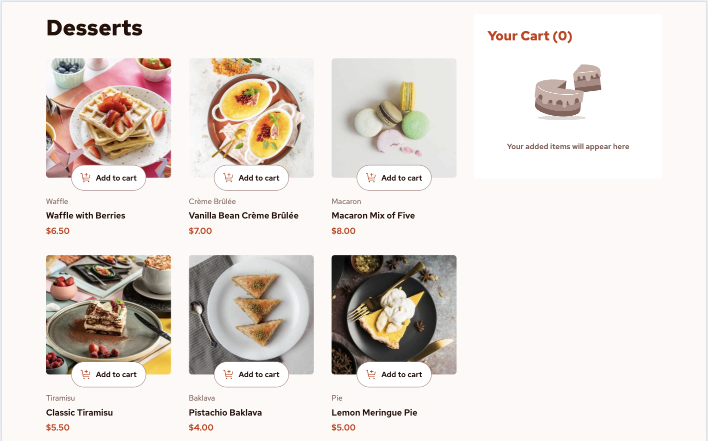
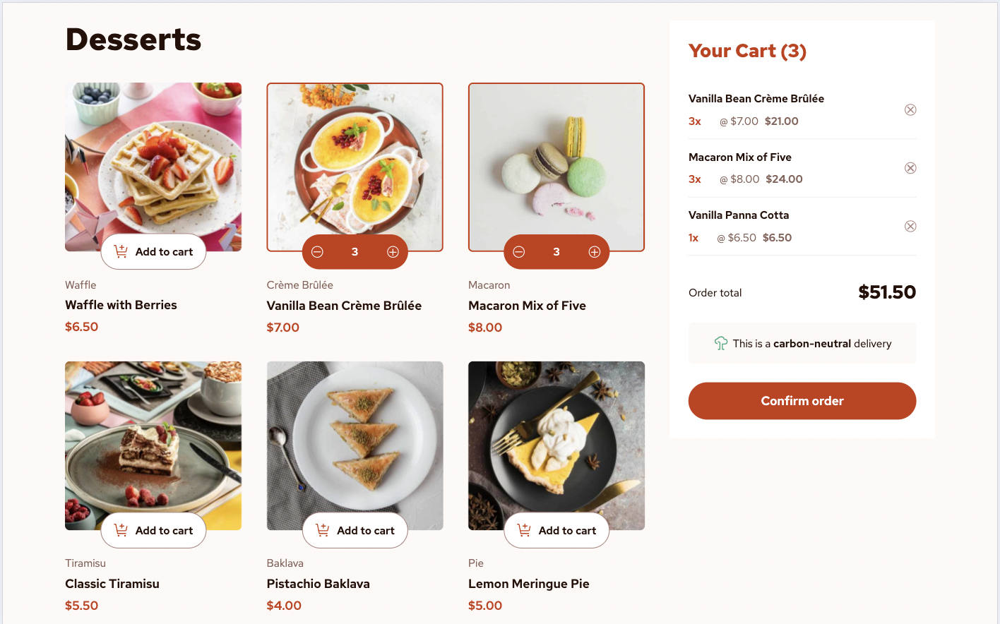
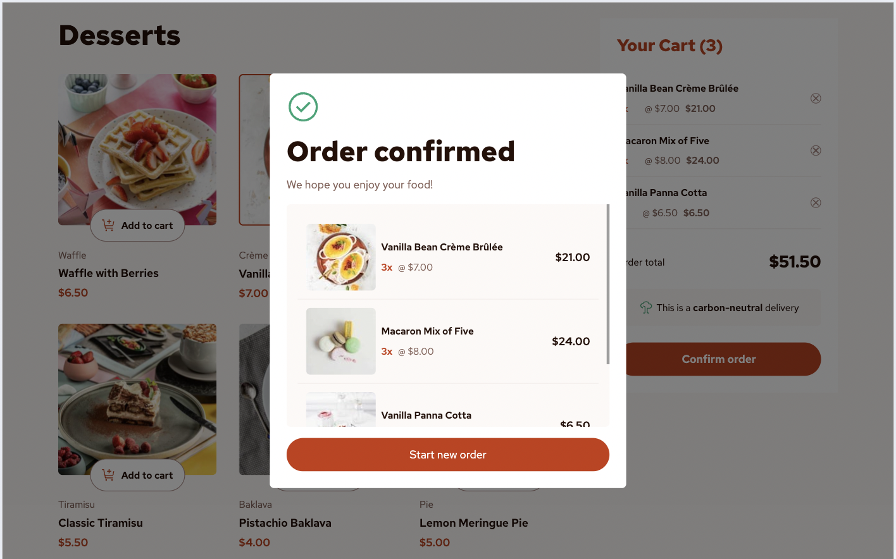
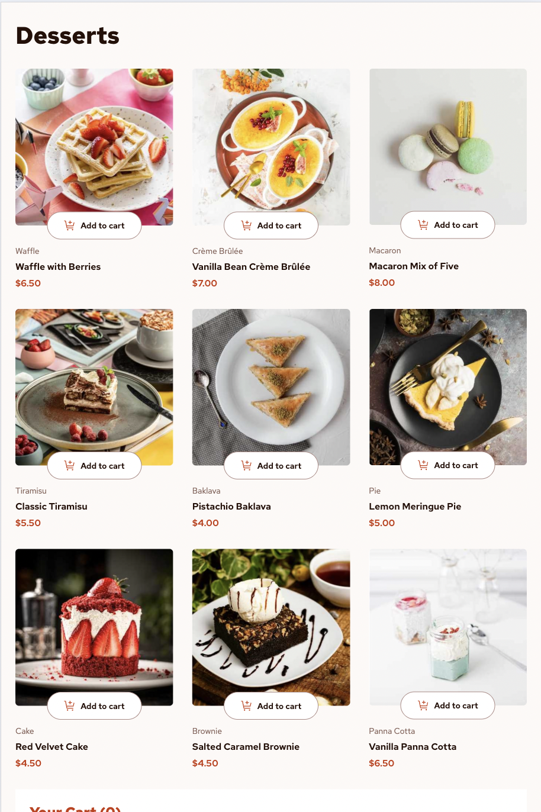
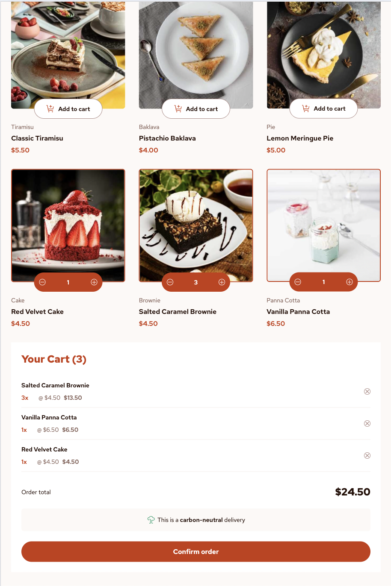
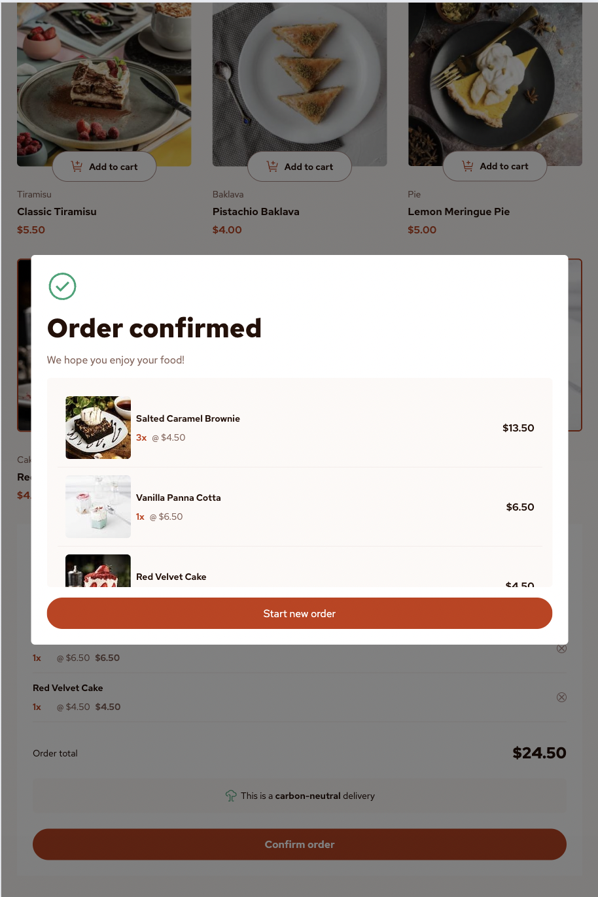
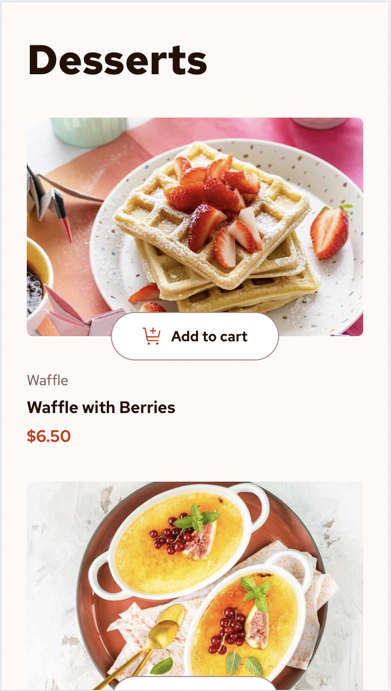
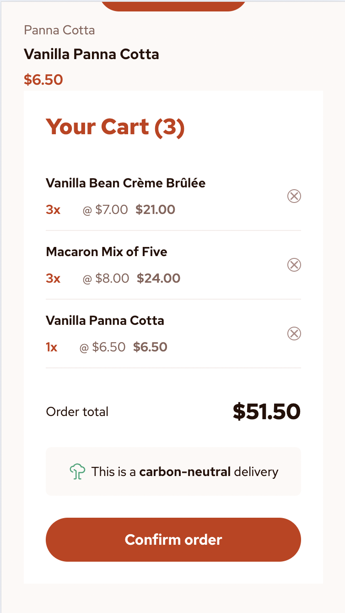
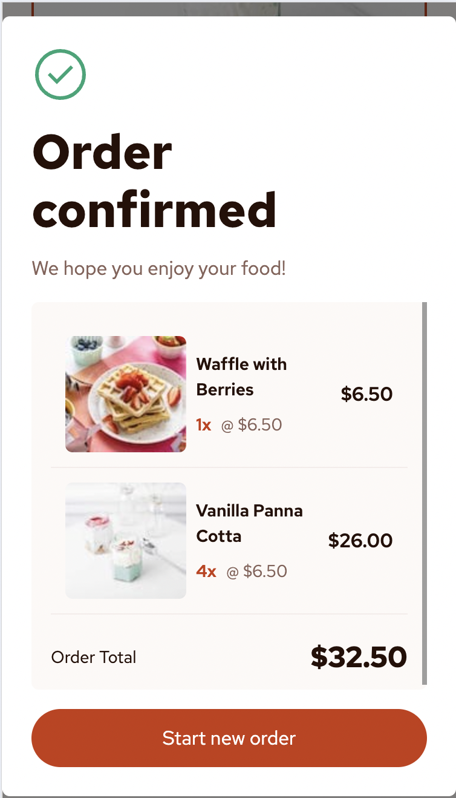

# Frontend Mentor - Product list with cart solution

## Welcome! 👋

This is a solution to the [Product list with cart challenge on Frontend Mentor](https://www.frontendmentor.io/challenges/product-list-with-cart-5MmqLVAp_d). Frontend Mentor challenges help you improve your coding skills by building realistic projects. 

## Table of contents

- [Overview](#overview)
  - [The challenge](#the-challenge)
  - [Screenshot](#screenshot)
  - [Links](#links)
- [My process](#my-process)
  - [Built with](#built-with)
  - [What I learned](#what-i-learned)
  - [Continued development](#continued-development)
  - [Useful resources](#useful-resources)
  - [AI Collaboration](#ai-collaboration)
- [Author](#author)
- [Acknowledgments](#acknowledgments)

## Overview

This project is an e-commerce application developed with React and Vite that allows users to view a list of products (desserts) and interactively manage a shopping cart.

### The challenge

Users should be able to:

- Add items to the cart and remove them
- Increase/decrease the number of items in the cart
- See an order confirmation modal when they click "Confirm Order"
- Reset their selections when they click "Start New Order"
- View the optimal layout for the interface depending on their device's screen size
- See hover and focus states for all interactive elements on the page

### Screenshot

### Links

- Solution URL: [Frontend Mentor]()
- Live Site URL: [Product List with Cart](https://product-list-with-cart-nhat.vercel.app/)

## My process

### Built with

- Semantic HTML5 markup
- CSS custom properties
- Flexbox
- Mobile-first workflow
- [Vite](https://vite.dev)
- [React](https://reactjs.org/) - JS library
- [Tailwind CSS](https://tailwindcss.com/) - For styles

### What I learned

During the development of this project, I reinforced and acquired several key concepts in frontend development:

- React State Management: How to structure and update state to manage a dynamic shopping cart, including the logic for adding, removing, and modifying product quantities.
- Conditional and Dynamic Rendering: How to display different UI states based on user interaction (for example, switching buttons to counters when a product is already in the cart).
- Consuming Data from JSON: I learned how to work with external data without the need for a backend, understanding how to properly structure information and handle common errors, such as the incorrect use of `.map()`.
- Asset Management in Production: I gained an understanding of the difference between using files in the `src` and `public` directories, and how this affects image loading in development versus production environments.
- Application Deployment: I gained experience deploying frontend applications on platforms like Vercel and troubleshooting common issues such as incorrect routes, environment variables, and 404 errors.
- Debugging in Production: I developed skills to identify and resolve errors using tools like DevTools, analyzing network requests, and verifying environment configurations.
- Project Structure Best Practices: Improved component organization, separation of logic, and enhanced code readability.

## Author

- Website - [Laura Elena Mesa](https://portfolio-app-three-red.vercel.app/)
- Frontend Mentor - [@laurymesa01](https://www.frontendmentor.io/profile/laurymesa01)
- LinkedIn - [@lauraelenamesa](https://www.linkedin.com/in/lauraelenamesa/)

